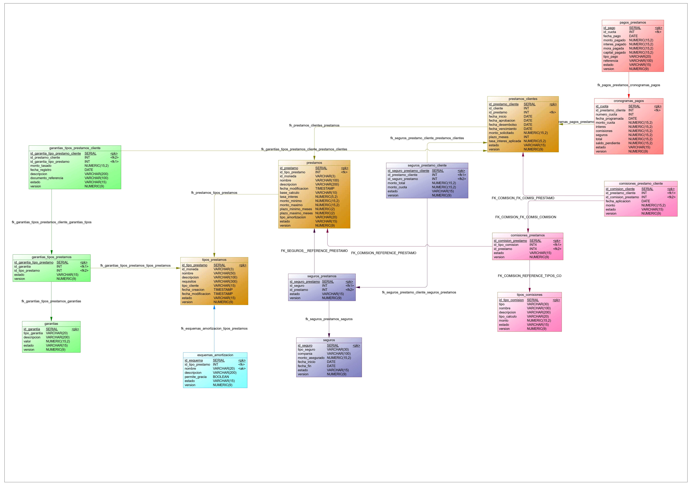

# LOANS MODULE 💵

## MODEL


## TABLES(in order)
- Garantia
- Seguro
- TiposComisione
---
- TiposPrestamo
- EsquemasAmortizacion
- Prestamo
- PrestamosCliente
---
- GarantiasTiposPrestamo
- ComisionesPrestamo
- SegurosPrestamo
---
- GarantiasTiposPrestamosCliente
- SegurosPrestamoCliente
- ComisionesPrestamoCliente
---
- CronogramasPago
- PagosPrestamo

## RELATIONS
- prestamos -> monedas
```bash
    alter table prestamos
    add constraint fk_prestamos_monedas foreign key (id_moneda)
        references monedas (id_moneda)
        on delete restrict on update restrict;
```
- tipos_prestamos -> monedas
```bash
    alter table tipos_prestamos
    add constraint fk_tipos_prestamos_monedas foreign key (id_moneda)
        references monedas (id_moneda)
        on delete restrict on update restrict;
```
- prestamos_clientes -> clientes
```bash
    alter table prestamos_clientes
    add constraint fk_prestamos_clientes_clientes foreign key (id_cliente)
        references clientes (id_cliente)
        on delete restrict on update restrict;
```

## CONSTRAINT OF LOANS

| TABLE                         | ATTRIBUTE        | CONSTRAINT                                                                                       | ENUM                        |
|:------------------------------|:------------------|:------------------------------------------------------------------------------------------------------|:-----------------------------|
| comisiones_prestamo_cliente   | `estado`          | ▫️ 'PENDIENTE'<br>▫️ 'CANCELADA'<br>▫️ 'EXENTA'                                                   | EstadoComisionClienteEnum   |
| comisiones_prestamos          | `estado`          | ▫️ 'ACTIVO'<br>▫️ 'INACTIVO'                                                                      | EstadoGeneralEnum           |
| tipos_comisiones              | `tipo`            | ▫️ 'ORIGINACION'<br>▫️ 'PAGO ATRASADO'<br>▫️ 'PREPAGO'<br>▫️ 'MODIFICACION'<br>▫️ 'SERVICIO ADICIONAL' | TipoComisionEnum            |
| tipos_comisiones              | `tipo_calculo`    | ▫️ 'PORCENTAJE'<br>▫️ 'FIJO'                                                                      | TipoCalculoComisionEnum     |
| tipos_comisiones              | `estado`          | ▫️ 'ACTIVO'<br>▫️ 'INACTIVO'                                                                      | EstadoGeneralEnum           |
| cronogramas_pagos             | `estado`          | ▫️ 'ACTIVO'<br>▫️ 'INACTIVO'<br>▫️ 'PENDIENTE'<br>▫️ 'PAGADO'                                     | EstadoCronogramaEnum        |
| esquemas_amortizacion         | `nombre`          | ▫️ 'FRANCES'<br>▫️ 'AMERICANO'<br>▫️ 'ALEMAN'                                                     | EsquemaAmortizacionEnum     |
| esquemas_amortizacion         | `estado`          | ▫️ 'ACTIVO'<br>▫️ 'INACTIVO'                                                                      | EstadoGeneralEnum           |
| garantias                     | `tipo_garantia`   | ▫️ 'HIPOTECA'<br>▫️ 'PRENDARIA'<br>▫️ 'PERSONAL'                                                  | TipoGarantiaEnum            |
| garantias                     | `estado`          | ▫️ 'ACTIVO'<br>▫️ 'INACTIVO'                                                                      | EstadoGeneralEnum           |
| garantias_tipos_prestamos     | `estado`          | ▫️ 'ACTIVO'<br>▫️ 'INACTIVO'                                                                      | EstadoGeneralEnum           |
| garantias_tipos_prestamos_cliente | `estado`     | ▫️ 'ACTIVO'<br>▫️ 'INACTIVO'                                                                      | EstadoGeneralEnum           |
| pagos_prestamos               | `estado`          | ▫️ 'COMPLETADO'<br>▫️ 'REVERTIDO'                                                                 | EstadoPagoEnum              |
| tipos_prestamos               | `tipo_cliente`    | ▫️ 'PERSONA'<br>▫️ 'EMPRESA'<br>▫️ 'AMBOS'                                                        | TipoClienteEnum             |
| tipos_prestamos               | `estado`          | ▫️ 'ACTIVO'<br>▫️ 'INACTIVO'                                                                      | EstadoGeneralEnum           |
| prestamos                     | `base_calculo`    | ▫️ '30/360'<br>▫️ '31/365'                                                                        | BaseCalculoEnum             |
| prestamos                     | `estado`          | ▫️ 'ACTIVO'<br>▫️ 'INACTIVO'<br>▫️ 'SOLICITADO'                                                   | EstadoPrestamoEnum          |
| prestamos_clientes            | `estado`          | ▫️ 'SOLICITADO'<br>▫️ 'APROBADO'<br>▫️ 'DESEMBOLSADO'<br>▫️ 'VIGENTE'<br>▫️ 'EN_MORA'<br>▫️ 'REFINANCIADO'<br>▫️ 'PAGADO'<br>▫️ 'CASTIGADO' | EstadoPrestamoClienteEnum |
| seguros                       | `tipo_seguro`     | ▫️ 'VIDA'<br>▫️ 'DESEMPLEO'<br>▫️ 'PROTECCION_PAGOS'<br>▫️ 'DESGRAVAMEN'<br>▫️ 'INCENDIOS'         | TipoSeguroEnum              |
| seguros                       | `estado`          | ▫️ 'ACTIVO'<br>▫️ 'VENCIDO'<br>▫️ 'CANCELADO'<br>▫️ 'INACTIVO'                                    | EstadoSeguroEnum            |
| seguros_prestamos             | `estado`          | ▫️ 'ACTIVO'<br>▫️ 'INACTIVO'                                                                      | EstadoGeneralEnum           |
| seguros_prestamo_cliente      | `estado`          | ▫️ 'ACTIVO'<br>▫️ 'INACTIVO'                                                                      | EstadoGeneralEnum           |

## Environment Variables

To run this project, you will need to add the following environment variables to your .env file


`SPRING_DATASOURCE_URL`

`SPRING_DATASOURCE_USERNAME`

`SPRING_DATASOURCE_PASSWORD`

## 🔐 ENDPOINTS

### 🏦 GARANTIAS

#### 📥 GET

```http
  GET /api/v1/garantias
```

#### ➕ POST

```http
  POST /api/v1/garantias
```

#### Request body
```javascript
{
  "tipoGarantia": "HIPOTECA",
  "descripcion": "HIPOTECARIA GARANITIA QUE ACEPTA BIENES INMOBILIARIOS.",
  "valor": 100000,
  "estado": "ACTIVO"
}
```
#### 🗑️ DELETE

```http
  DELETE /api/v1/garantias/{id}
```

#### ✏️ PUT 

```http
  PUT /api/v1/garantias/{id}
```

#### Request body
```javascript
{
  "tipoGarantia": "HIPOTECA",
  "descripcion": "HIPOTECARIA GARANITIA QUE ACEPTA BIENES INMOBILIARIOS.",
  "valor": 100000,
  "estado": "INACTIVO"
}
```

### 🛡️ SEGUROS

#### 📥 GET

```http
  GET /api/v1/seguros
```

#### ➕ POST

```http
  POST /api/v1/seguros
```

#### Request body
```javascript
{
  "tipoSeguro": "VIDA",
  "compania": "VIDA UNIDA",
  "montoAsegurado": 10000,
  "fechaInicio": "2025-06-22",
  "fechaFin": "2025-06-22",
  "estado": "ACTIVO"
}
```
#### 🗑️ DELETE

```http
  DELETE /api/v1/seguros/{id}
```

#### ✏️ PUT 

```http
  PUT /api/v1/seguros/{id}
```

#### Request body
```javascript
{
  "tipoSeguro": "VIDA",
  "compania": "VIDA UNIDA",
  "montoAsegurado": 10000,
  "fechaInicio": "2025-06-22",
  "fechaFin": "2025-06-22",
  "estado": "INACTIVO"
}
```

### 💸 TIPOS COMISIONES

#### 📥 GET

```http
  GET /api/v1/tipos-comisiones
```

#### ➕ POST

```http
  POST /api/v1/tipos-comisiones
```

#### Request body
```javascript
{
  "tipo": "PREPAGO",
  "nombre": "PREPAGO COMISION",
  "descripcion": "COMISION DE TIPO PREPAGO PARA LOS PRESTAMOS.",
  "tipoCalculo": "PORCENTAJE",
  "monto": 1000,
  "estado": "ACTIVO"
}
```
#### 🗑️ DELETE

```http
  DELETE /api/v1/tipos-comisiones/{id}
```

#### ✏️ PUT 

```http
  PUT /api/v1/tipos-comisiones/{id}
```

#### Request body
```javascript
{
  "tipo": "PREPAGO",
  "nombre": "PREPAGO COMISION",
  "descripcion": "COMISION DE TIPO PREPAGO PARA LOS PRESTAMOS.",
  "tipoCalculo": "PORCENTAJE",
  "monto": 1000,
  "estado": "INACTIVO"
}
```

### 🧾 TIPOS DE PRESTAMOS
#### 📥 GET

```http
  GET /api/v1/tipos-prestamos
```

#### ➕ POST

```http
  POST /api/v1/tipos-prestamos
```

#### Request body
```javascript
{
  "idMoneda": "USD",
  "nombre": "PERSONAL",
  "descripcion": "PRESTAMO DE TIPO PERSONAL.",
  "requisitos": "VARIOS",
  "tipoCliente": "PERSONA",
  "fechaCreacion": "2025-06-22T08:18:38.633Z",
  "fechaModificacion": "2025-06-22T08:18:38.633Z",
  "estado": "ACTIVO"
}
```
#### 🗑️ DELETE

```http
  DELETE /api/v1/tipos-prestamos/{id}
```

#### ✏️ PUT 

```http
  PUT /api/v1/tipos-prestamos/{id}
```

#### Request body
```javascript
{
  "idMoneda": "USD",
  "nombre": "PERSONAL",
  "descripcion": "PRESTAMO DE TIPO PERSONAL.",
  "requisitos": "VARIOS",
  "tipoCliente": "PERSONA",
  "fechaCreacion": "2025-06-22T08:18:38.633Z",
  "fechaModificacion": "2025-06-22T08:18:38.633Z",
  "estado": "ACTIVO"
}
```

### 📊 ESQUEMAS DE AMORTIZACION
#### 📥 GET

```http
  GET /api/v1/esquemas-amortizacion
```

#### ➕ POST

```http
  POST /api/v1/esquemas-amortizacion
```

#### Request body
```javascript
{
  "idTipoPrestamo": 2,
  "nombre": "ALEMAN",
  "descripcion": "ESQUEMA DE AMORTIZACION ALEMAN",
  "permiteGracia": true,
  "estado": "ACTIVO"
}
```
#### 🗑️ DELETE

```http
  DELETE /api/v1/esquemas-amortizacion/{id}
```

#### ✏️ PUT 

```http
  PUT /api/v1/esquemas-amortizacion/{id}
```

#### Request body
```javascript
{
  "idTipoPrestamo": 2,
  "nombre": "ALEMAN",
  "descripcion": "ESQUEMA DE AMORTIZACION ALEMAN",
  "permiteGracia": true,
  "estado": "ACTIVO",
}
```

### 💰 PRESTAMOS
#### 📥 GET

```http
  GET /api/v1/prestamos
```

#### ➕ POST

```http
  POST /api/v1/prestamos
```

#### Request body
```javascript
{
  "idTipoPrestamo": 2,
  "idMoneda": "USD",
  "nombre": "PERSONAL SOLTERO",
  "descripcion": "PRESTAMO PERSONAL PARA PERSONAS SOLTERAS.",
  "fechaModificacion": "2025-06-22T08:20:49.355Z",
  "baseCalculo": "30/360",
  "tasaInteres": 10,
  "montoMinimo": 1000,
  "montoMaximo": 10000,
  "plazoMinimoMeses": 12,
  "plazoMaximoMeses": 24,
  "tipoAmortizacion": "ALEMAN",
  "estado": "ACTIVO"
}
```
#### 🗑️ DELETE

```http
  DELETE /api/v1/prestamos/{id}
```

#### ✏️ PUT 

```http
  PUT /api/v1/prestamos/{id}
```

#### Request body
```javascript
{
  "idTipoPrestamo": 2,
  "idMoneda": "USD",
  "nombre": "PERSONAL SOLTERO",
  "descripcion": "PRESTAMO PERSONAL PARA PERSONAS SOLTERAS.",
  "fechaModificacion": "2025-06-22T08:20:49.355Z",
  "baseCalculo": "30/360",
  "tasaInteres": 10,
  "montoMinimo": 1000,
  "montoMaximo": 10000,
  "plazoMinimoMeses": 12,
  "plazoMaximoMeses": 24,
  "tipoAmortizacion": "ALEMAN",
  "estado": "ACTIVO"
}
```

### 👥 PRESTAMOS CLIENTES
#### 📥 GET

```http
  GET /api/v1/prestamos-clientes
```

#### ➕ POST

```http
  POST /api/v1/prestamos-clientes
```

#### Request body
```javascript
{
  "idCliente": 5,
  "idPrestamo": 3,
  "fechaInicio": "2025-06-22",
  "fechaAprobacion": "2025-06-22",
  "fechaDesembolso": "2025-06-22",
  "fechaVencimiento": "2025-06-22",
  "montoSolicitado": 2000,
  "plazoMeses": 6,
  "tasaInteresAplicada": 10,
  "estado": "SOLICITADO"
}
```
#### 🗑️ DELETE

```http
  DELETE /api/v1/prestamos-clientes/{id}
```

#### ✏️ PUT 

```http
  PUT /api/v1/prestamos-clientes/{id}
```

#### Request body
```javascript
{
  "idCliente": 5,
  "idPrestamo": 3,
  "fechaInicio": "2025-06-22",
  "fechaAprobacion": "2025-06-22",
  "fechaDesembolso": "2025-06-22",
  "fechaVencimiento": "2025-06-22",
  "montoSolicitado": 2000,
  "plazoMeses": 6,
  "tasaInteresAplicada": 10,
  "estado": "VIGENTE"
}
```